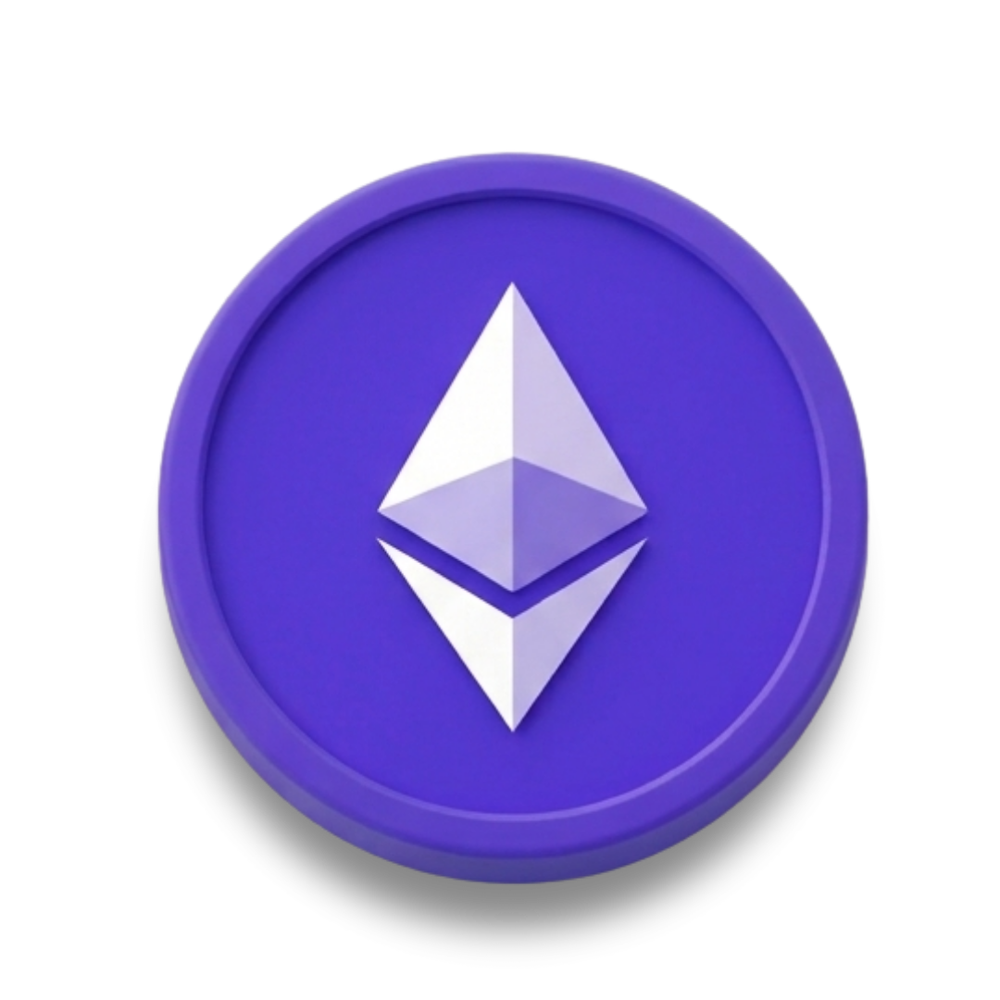

# Projeto Currency 💰

**`Conversor de Moedas`**

Este é um conversor câmbial que tem como base a valor de cada respectiva moeda do dia <b>01-07</b>.
Nesse projeto usei como base um projeto de estudos em <b>JavaScript</b> que convertia somente do real para outras moedas. Depos de varias adaptações o que apresento é um projeto totalmente novo, em design e código!

<a href="https://carlosmacedo-byte.github.io/Currency-convert/" target="_blank">Site Projeto Currency</a> 👈

### Adaptações

- De qualquer moeda para qualquer moeda 
- Design exclusivo 
- Inplementação das variáveis de cálculo
- Responsividade

### Moedas 

 
        
        
        
        
        

### Cripto Moedas 
 
        
        

### 🤖 Linguagens e Tecnologias

 
    

