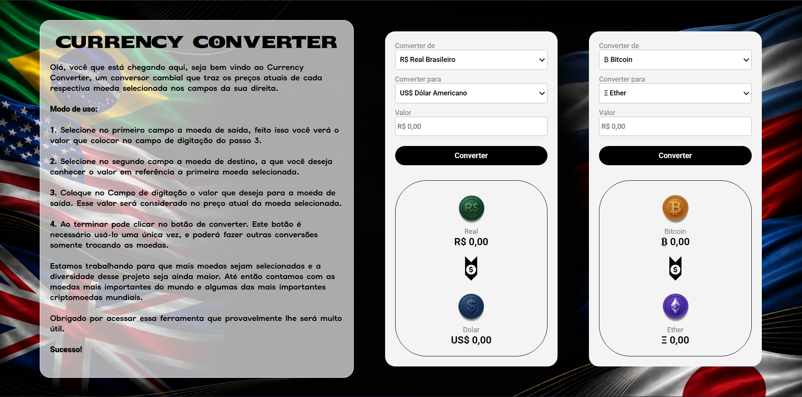

# 🔀 Currency Converter

Uma aplicação web moderna, dinâmica e responsiva desenvolvida para conversão de moedas e criptomoedas em tempo real. O projeto consome taxas de câmbio atualizadas via API REST externa e aplica internacionalização nativa para formatação de valores.

🌐 **[Acesse a Aplicação ao Vivo](https://carlosmacedo-byte.github.io/currency-converter/)**

---

## 📸 Demonstração da Interface



---

## 🔥 Diferenciais Técnicos e Funcionalidades

- **Cotações em Tempo Real:** Consumo da API REST pública (`AwesomeAPI`) via requisições assíncronas (`async/await` / `fetch`).
- **Internacionalização (i18n):** Uso da API nativa `Intl.NumberFormat` para formatação precisa de símbolos, casas decimais e separadores por localidade (`pt-BR`, `en-US`, `ja-JP`, `zh-CN`, etc.).
- **Conversão de Criptomoedas:** Módulo exclusivo para moedas digitais como Bitcoin, Ethereum, Solana, XRP, entre outras.
- **Tratamento de Exceções:** Validação de taxas indisponíveis e respostas visuais de erro com fluxo resiliente (`try/catch`).
- **UI/UX Responsiva e Dinâmica:** Troca instantânea de bandeiras, símbolos, placeholders e nomes de moedas ao alterar as opções.

---

## 🛠️ Tecnologias Utilizadas

- **HTML5:** Estruturação semântica e acessível.
- **CSS3:** Estilização customizada, suporte a temas, layouts flexíveis e responsividade.
- **JavaScript (ES6+):** Manipulação de DOM, requisições assíncronas, objetos de configuração e lógica de conversão.
- **AwesomeAPI:** API REST externa para consulta de taxas de câmbio de moedas internacionais.

---

## 💱 Moedas e Criptomoedas Suportadas

| Tipo | Ativos Suportados |
| :--- | :--- |
| **Moeda** | Real (BRL), Dólar (USD), Euro (EUR), Libra (GBP), Yuan (CNY), Iene (JPY), Peso (ARS), Rublo (RUB) |
| **Cripto** | Bitcoin (BTC), Ether (ETH), Dogecoin (DOGE), Litecoin (LTC), XRP (XRP), Solana (SOL), Binance Coin (BNB) |

---

## 📁 Como Rodar o Projeto Localmente

1. Clone o repositório:
   ```bash
   git clone [https://github.com/carlosmacedo-byte/Currency-convert.git](https://github.com/carlosmacedo-byte/Currency-convert.git)