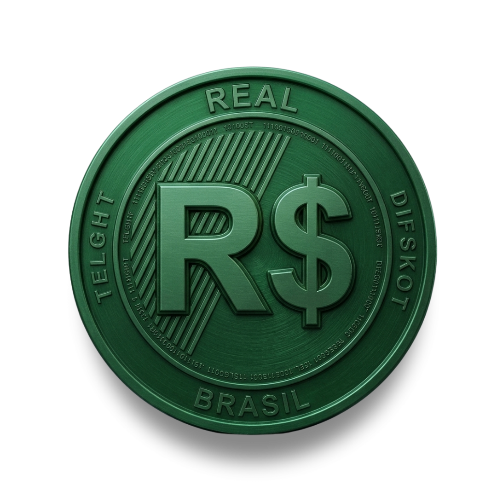
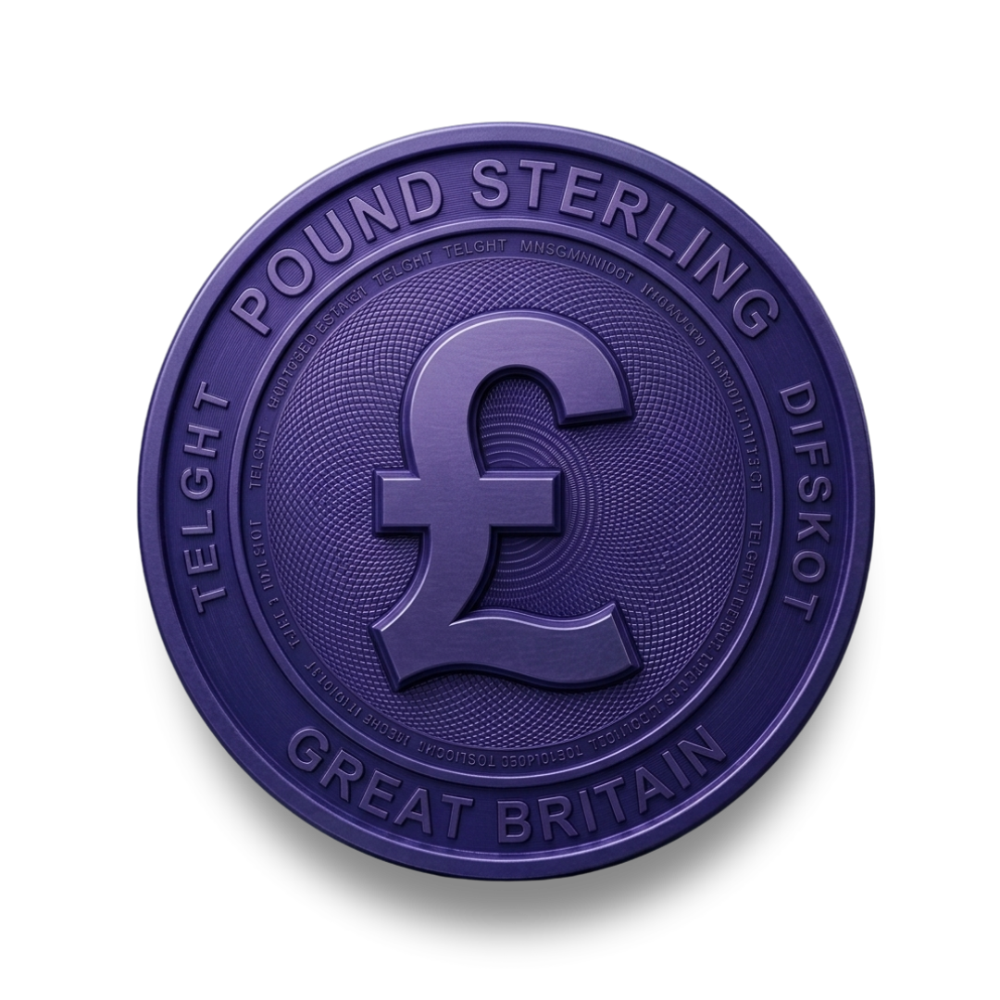

# Projeto Currency 💰

**`Conversor de Moedas`**

Este é um conversor cambial que tem como base o valor de cada respectiva moeda do dia **01-07**.
Nesse projeto usei como base um projeto de estudos em **JavaScript** que convertia somente do real para outras moedas. Depois de várias adaptações, o que apresento é um projeto totalmente novo, em design e código!

<a href="https://carlosmacedo-byte.github.io/Currency-convert/" target="_blank">Acessar Site do Projeto Currency</a> 👈

### Adaptações

- De qualquer moeda para qualquer moeda 
- Design exclusivo 
- Implementação das variáveis de cálculo
- Responsividade

### Moedas Suportadas

  
  
  
  
  

### Criptomoedas Suportadas

  
  

### 🤖 Linguagens e Tecnologias

  
  &nbsp;
  
  &nbsp;
  

